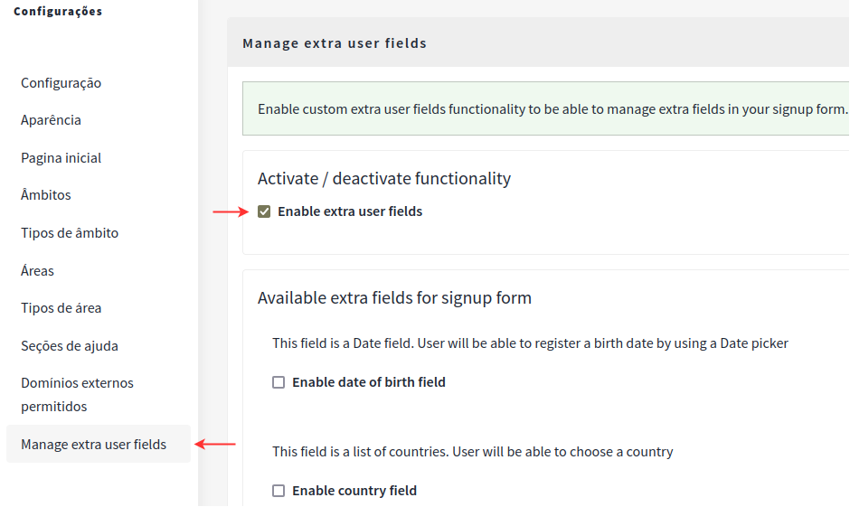
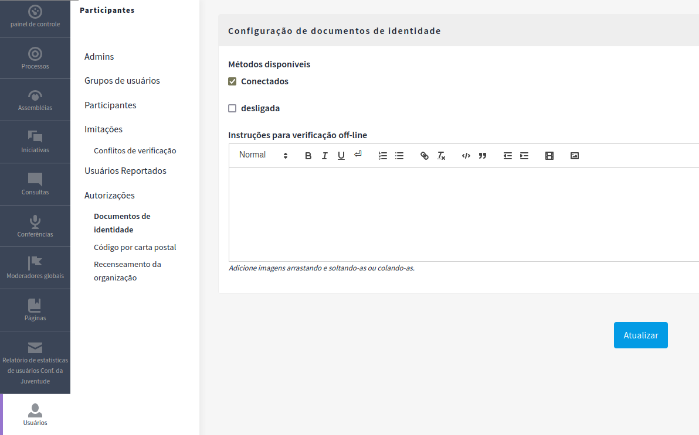
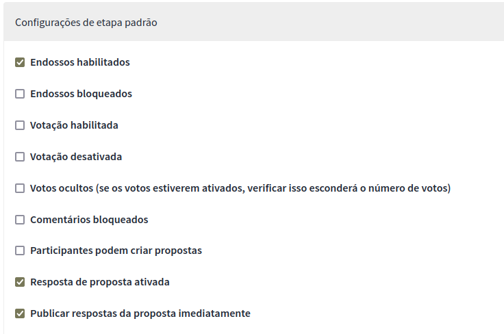

# Decidim::ExtraUserFields
## Instalação do Módulo “decidim-extra_user_fields” em Modo de Desenvolvimento

O módulo “decidim-extra_user_fields” é uma extensão para o Decidim. Esse módulo permite o cadastro e autenticação de **usuários estrangeiros** por meio da inclusão de novos campos. Esses campos adicionais podem incluir informações como o **tipo de documento** (como passaporte ou DNI) e o ***número do documento***.Se você deseja instalá-lo em modo de desenvolvimento, siga as etapas abaixo:

1. **Clonar o repositório**
- Abra o terminal e navegue até o diretório onde o projeto “decidim-govbr” está localizado (não entre na pasta decidim-govbr)
- Execute o seguinte comando para clonar o repositório “decidim-extra_user_fields”:

```
git clone https://gitlab.com/lappis-unb/decidimbr/decidim-extra_user_fields.git
```

2. **Configurar o Docker Compose**
- Abra o arquivo `docker-compose.yml` do projeto “decidim-govbr”.
- Adicione o seguinte volume para mapear o código do “decidim-extra_user_fields” dentro do “decidim-govbr”:

```
volumes:
  - ../decidim-extra_user_fields:/decidim-govbr/vendor/decidim-extra_user_fields
```

3. **Adicionar a Gem “decidim-extra_user_fields”**
- No arquivo `Gemfile` do projeto “decidim-govbr”, adicione a seguinte linha:

```
gem 'decidim-extra_user_fields', path: 'vendor/decidim-extra_user_fields'
```

4. **Atualizar o Gemfile.lock**
- No arquivo `Gemfile.lock`, adicione a seção “PATH” com a referência ao diretório do “decidim-extra_user_fields”:

```
PATH
  remote: vendor/decidim-extra_user_fields
  specs:
    decidim-extra_user_fields (0.27.2)
      country_select (~> 4.0)
      decidim-core (>= 0.27.0, < 0.28)
      deface (~> 1.5)
```

## Configuração do Módulo no Painel de Administração

É necessário habilitar a opção **Enable extra user fields** no painel de administração para usar os novos campos no formulário de registro. Para isso acesse a opção **Configurações** e em seguida escolha a opção **Manage extra user fields**.



Logo após é possível habilitar os campos extras que irão compor o formulário de registro. As opções de campos extras são:

- **Data de Nascimento**
- **País**
- **Código Postal**
- **Gênero**
- **Número de Telefone**
- **Localização**
- **Número do Documento**
- **Imagem do Documento**
- **Validação do Documento**
- **Tipo de Documento**

Para o cadastro de pessoas estrangeiras é necessário habilitar os campos **Número do Documento, Imagem do Documento, Validação do Documento e Tipo de Documento** para poder fazer a verificação do usuário. Também é necessário habilitar a autorização via documento de identidade no painel de administração.

### Habilitando a autorização via documentos de identidade

Para habilitar a autorização via documentos de identidade, siga os passos abaixo:

1. Acesse a seção **Participants** (Usuários) no painel de administração.
2. Navegue até **Authorizations** (Autorizações) e selecione **Identity documents** (Documentos de identidade).
3. Marque a opção **Online (Conectado)** para o método de verificação.
4. Com esse método, os participantes farão o upload dos documentos, e os administradores revisarão os mesmos.



Para mais detalhes, consulte a [documentação oficial](https://docs.decidim.org/en/develop/admin/participants/authorizations/identity_documents.html).
 

## Autenticação de usuários estrangeiros

A autenticação de usuários estrangeiros será realizada manualmente por meio do formulário de registro, não sendo possível utilizar a autenticação via **gov.br**.

Um dos passos do preenchimento do formulário envolve o preenchimento dos campos **Número do Documento**, **Tipo do Documento** e **Imagem do Documento**. No campo **Imagem do Documento** é necessário que o usuário faça o upload de uma foto dele segurando o documento de identificação (passaporte ou DNI).


Depois de submeter o registro, o administrador do sistema ficará responsável por verificar e autorizar esse registro.  Sendo que a verificação será feita no painel de administrador, na opção **Usuários** → **Autorizações** → **Documentos de Identidade**.

Para isso, foi necessário implementar um método send_verification para criar uma nova verificação do tipo **IdDocument** que é chamado logo após a criação do user:

```ruby
# app/commands/concerns/decidim/extra_user_fields/create_registrations_commands_overrides.rb
def send_verification
  @register_form = Decidim::Verifications::IdDocuments::UploadForm.new(user: @user).with_context(current_organization:form.current_organization)
         
  @register_form.verification_type = "online"
  @register_form.document_number = form.document_number
  @register_form.document_type = form.document_type
  @register_form.verification_attachment = form.document_image
        
  @authorization = Decidim::Authorization.    find_or_initialize_by(
    user: @user,
    name: "id_documents"
  )
        
  @authorization.verification_attachment = @register_form.verification_attachment
        

  Decidim::Verifications::PerformAuthorizationStep.call(@authorization, @register_form) do
    on(:ok) do
      flash[:notice] = t("authorizations.create.success", scope: "decidim.verifications.id_documents")
    end

    on(:invalid) do
      flash.now[:alert] = t("authorizations.create.error", scope: "decidim.verifications.id_documents")
    end
  end
end
```

Assista ao [vídeo exemplificando o fluxo de autenticação e verificação do usuário estrangeiro](https://www.loom.com/share/c095e454ea494608b748455aeed76dd8?sid=f3c52228-7ca2-42b8-88f7-5f10ac7b68c0).


## Validação de usuários cadastrados via Gov.br

Quando habilitamos a opção **Identity Documents** nas autorizações, o comportamento padrão é solicitar o número e a foto do documento de todos os usuários. No entanto, o comportamento desejado é que os usuários logados via gov.br não precisem fornecer esses dados de 
documento, uma vez que essa informação é necessária apenas para usuários estrangeiros.

Para resolver esse problema, implementamos o método **grant_authorization**, que autoriza o usuário logado com o **gov.br**, validando-o sem a necessidade de apresentar um documento oficial.

Aqui está o trecho de código que deve ser chamado logo após a criação do usuário logado via **gov.br**:

```ruby
# app/commands/decidim/create_omniauth_registration.rb
def grant_authorization
  # If the Authorization option is enabled in the admin panel, all users will be required to upload 
  # an identification document. However, this verification is not intended for users who registered 
  # through govbr. In this method, authorization is granted to users registered with govbr.

  @authorization = Decidim::Authorization.find_or_initialize_by(user: @user, name: "id_documents")
      
  if @authorization
    @authorization.grant!
  end
end
```

## Permissões de acesso a componentes

- **Usuários Brasileiros Logados com Gov.br:** Têm acesso a todos os componentes e podem participar ativamente.
- **Usuários Estrangeiros Não Verificados:** Não têm acesso e não podem participar nos componentes.
- **Usuários Estrangeiros Verificados:** Podem participar em **Textos Participativos** através de comentários (componente **Comments**).

Para garantir que usuários estrangeiros possam participar adequadamente, implementamos o seguinte fluxo:

1. Primeiramente, foi definido uma lista que contém os componentes permitidos, no arquivo *lib/decidim/extra_user_fields/gov_br_action_authorizer.rb. Ficou definido que o usuário estrangeiro está autorizado a participar em Proposals do tipo participatory_text e em Surveys.*

```ruby
AUTHORIZED_COMPONENTS=[
  {
    "name" => "Proposals",
    "condition" => "participatory_texts_enabled"
  }, {
    "name" => "Survey",
  }
]
```

2. Logo após, será verificado se o usuário é estrangeiro (`is_non_govbr_user?`) e se ele está tentando acessar um componente que não está na lista de componentes permitidos (`component_unauthorized?`).

3. Um outro ponto é que as permissões de Documentos de Identidade são marcadas automaticamente assim que um componente é publicado. Dessa forma, sempre será verificado se o usuário teve o seu documento validado e caso positivo, ele poderá participar. O método update_permissions no arquivo app/commands/decidim/extra_user_fields/admin/publish_component.rb é responsável por fazer essa configuração de forma automática:

```ruby
def update_permissions
  actions = component&.manifest&.actions
  permissions = actions.inject({}) do |result, action|
    handlers_content = { "id_documents" => {} }
    serialized = {
      "authorization_handlers" => handlers_content
    }
    result.update(action => serialized)
  end
  component.update!(permissions: permissions)
  permissions
end
```

### Como adicionar novos componentes autorizados

Segue-se uma explicação de como criar um componente do tipo Texto Participativo:

1. Acesse a opção **Assembléias** no menu lateral esquerdo do painel do administrador. Dentro dessa página, escolha a opção **Componentes** e, logo após, clique no botão **Adicionar Componentes** e escolha a opção **Propostas**.
2. Na criação da nova proposta, marcar a opção **Textos participativos habilitados**.
3. Restrições de uso podem ser configuradas na hora de criar uma proposta. Como, por exemplo, se o usuário pode votar na proposta e se ele pode comentar. Conforme a imagem a seguir:



4. Depois de criado, acesse esse novo componente e clique no botão Textos Participativos. Em seguida importe o documento, em formato **Markdown**, **ODT**, contendo todos os textos. Depois disso as propostas estão prontas para serem publicadas.

**Observação:** Lembramos que, de acordo com os requisitos atuais da aplicação, apenas componentes do tipo Propostas (Texto Participativo) são autorizados para participação por usuários estrangeiros.

Os vídeos a seguir demonstram a [gestão das permissões](https://www.loom.com/share/944e11305c7047d59dd20abae27d07c1) e a [participação em um texto participativo](https://www.loom.com/share/4132c49a325b47fcbe3fdab4948a5cfd?sid=d4fdcf9f-1cf3-421a-9b97-0e1711d9a16d)


## More on decidim-extra_user_fields documentation
https://github.com/PopulateTools/decidim-module-extra_user_fields

## License

This engine is distributed under the GNU AFFERO GENERAL PUBLIC LICENSE.
